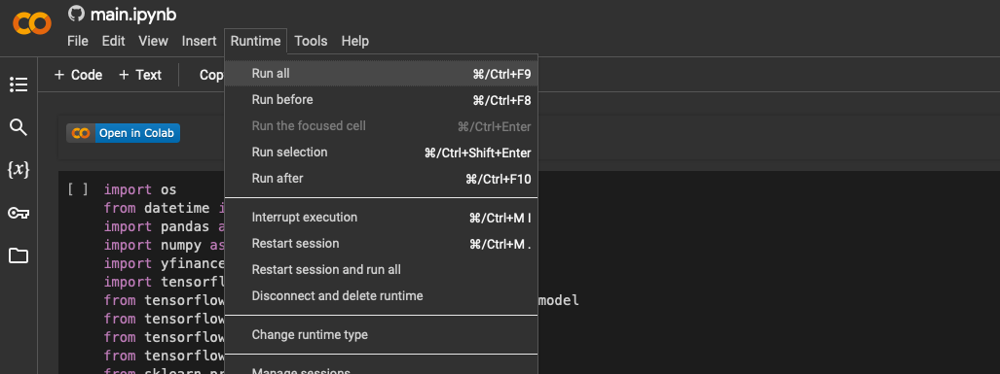

# Neural Network Trading Algo

[](https://cookiecutter-data-science.drivendata.org/) [](https://colab.research.google.com/github/Joshbazz/Neural_Network_Trading_Algo/blob/main/main.ipynb)

This project implements a neural network strategy for trading based on the research paper titled 'A Stock Market Trading System using Deep Neural Network' by Bang Xiang Yong, Mohd Rozaini Abdul Rahim, and Ahmad Shahidan Abdullah. You can access the paper [here](https://api.repository.cam.ac.uk/server/api/core/bitstreams/ee20ae76-656a-47ba-bf5b-fba10ee87478/content).

You can view the detailed write-up about the code [here](https://joshbazzano.substack.com/p/d97c31d9-0919-465f-9584-af0e4e904131).

## Project Structure

The Python implementation resides in the `neural_network_trading_algo` directory. To run the project:
1. Navigate to the `main.py` file in your terminal.
2. Execute the file to perform:
   - Data gathering
   - Preprocessing
   - Model training
   - Model saving
   - Model evaluation
   - Signal generation
   - Backtesting the strategy on generated signals

## Installation

To install the required packages and dependencies, follow these steps:

1. **Clone the Repository**:
   
   ```bash
   git clone https://github.com/Joshbazz/Neural_Network_Trading_Algo.git
   cd Neural_Network_Trading_Algo

2. **Create a Virtual Environment with Make (optional but recommended)**
   ```makefile
   make create_environment


3. **Install Dependencies**
   ```makefile
   make requirements

**NOTE:** You'll need to locally install Graphviz and/or Make in order to run the `make` commands and create the model visualization. To download Make for Windows, open up Powershell and run: winget install ezwinports.make 
Links for downloading Make (Windows) are [here](https://gnuwin32.sourceforge.net/packages/make.htm), and downloads for Graphviz are included [here](https://graphviz.org).


## Run the Code in Google Colab

If you prefer running the code without downloading the repository or if you're a non-technical user, you can run the project directly in Google Colab. Click the badge below to open the notebook in your browser:

[](https://colab.research.google.com/github/Joshbazz/Neural_Network_Trading_Algo/blob/main/main.ipynb)

Simply navigate to the top bar, and under Runtime, click on "Run All" (see below):



Note: Initial downloads may be required when running in Colab.

